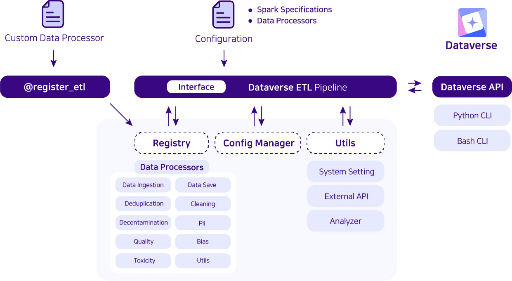

.. dataverse documentation master file, created by
   sphinx-quickstart on Thu Feb 29 19:54:35 2024.
   You can adapt this file completely to your liking, but it should at least
   contain the root `toctree` directive.

===================
Dataverse
===================

.. image:: ../images/dataverse_logo-color.png

Dataverse is a freely-accessible open-source project that supports your ETL pipeline with Python.
We offer a simple, standardized and user-friendly solution for data processing and management, catering to the needs of data scientists, analysts, and developers in LLM era. Even though you don't know much about Spark, you can use it easily via dataverse.

With Dataverse, you are empowered to
--------------------------------------

- utilize a range of preprocessing functions without the need to install multiple libraries.
- create high-quality data for analysis and training of Large Language Models (LLM).
- leverage Spark with ease, regardless of your expertise level.
- facilitate smoother collaboration among users with varying degress of Spark proficiency.
- enjoy freedom from the limitations of local environments by harnessing the capabilities of AWS EMR.

Architecture of Dataverse
--------------------------------------

Key Features of Dataverse
--------------------------------------
- **Block-Based**: In Dataverse, a `block` means a `registered ETL function` which is running on Spark. You can build Spark code like putting together puzzle pieces. You can easily add, take away, or re-arrange pieces to get the results you want via configure.
- **Configure-Based**: All the setups for Spark and steps of block can be defined with configure. You don't need to know all the code. Just set up the options, and you're good to go.
- **Extensible**: It's designed to meet your specific demands, allowing for custom features that fit perfectly with your project.

If you want to know more about Dataverse, please checkout our `docs <https://data-verse.gitbook.io/docs/>`__.

.. toctree::
   :maxdepth: 2
   :hidden:
   :caption: Getting Started

   installation
   quickstart
   citation

.. toctree::
   :maxdepth: 5
   :hidden:
   :caption: Documentation

   etl/etl
   config/config.interface

Indices and tables
==================

* :ref:`genindex`
* :ref:`modindex`
* :ref:`search`
